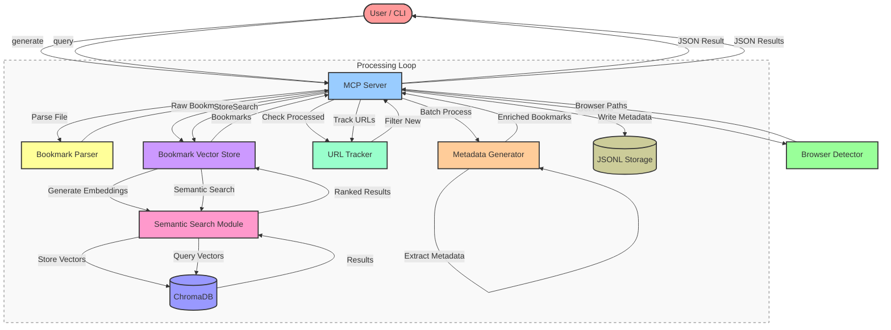

# Bookmark Geni MCP Server

Stand-alone MCP (Model Context Protocol) server for processing browser bookmarks, extracting HTML content and metadata, and semantic search.

## Features

- 🔍 **Multi-Browser Support**: Reads bookmarks from Chrome, Edge, Firefox, Opera, ChatGPT Atlas, and Perplexity Comet
- 📄 **Content Extraction**: Fetches HTML content from URLs and extracts text for semantic search
- 🏷️ **Metadata Extraction**: Extracts descriptions from HTML metadata tags (Open Graph, meta description, title)
- 📊 **Vector Storage**: Stores bookmark embeddings in ChromaDB using sentence transformer model (all-MiniLM-L6-v2)
- 🔎 **RAG Search**: Query bookmarks using natural language with metadata filtering
- 📦 **Portability**: Export and import embeddings to/from pickle files for easy transfer
- ⚡ **Performance**: Batch processing with concurrency and caching


## Installation

1. Install dependencies:
   ```bash
   pip install -r requirements.txt
   ```

2. Configure the server by editing `config.yaml` (optional - defaults are provided)

3. Make start script executable:
   ```bash
   chmod +x scripts/start_mcp_server.sh
   ```

## Usage

Once the server is started, it can be used with any MCP client.
To index all browser bookmarks and generate metadata, run the following command:

```bash
"Generate metadata for chrome bookmarks"
```
Once all bookmarks are indexed, you can query them using the following command:

```bash
"Query bookmarks for 'python'"
```

### Standalone MCP Server

The server can be used independently with any MCP client by referencing `mcp.json`:

```bash
# Start the server using the bash script
./scripts/start_mcp_server.sh
```

### With Gemini CLI 

Connect the server to the Gemini CLI using the following command:

```bash
# Add the server configuration to your Gemini CLI settings
# Edit ~/.gemini/settings.json and add the following to the "mcpServers" section:

{
  "mcpServers": {
    "bookmarkGeni": {
      "command": "bash",
      "args": ["/path/to/bookmark_geni_mcp/scripts/start_mcp_server.sh"],
      "env": {
        "PYTHON_PATH": "/path/to/your/python3"
      }
    }
  }
}

# Or use the provided mcp.json as a reference for the configuration
```

### With Calude Desktop

Connect the server to the Calude Desktop by adding the following to the Calude Desktop settings:

```json
{
  "mcpServers": {
    "bookmarkGeni": {
      "command": "bash",
      "args": ["/path/to/bookmark_geni_mcp/scripts/start_mcp_server.sh"],
      "env": {
        "PYTHON_PATH": "/usr/bin/python3"
      }
    }
  }
}
```   


**Note**: Replace `/path/to/bookmark_geni_mcp` with the actual path to this repository and `/path/to/your/python3` with your Python interpreter path.

## Configuration

The server reads configuration from `config.yaml` in the MCP server root directory. This includes:
- Browser enable/disable settings
- ChromaDB path (relative to MCP server root or absolute path)
- Metadata JSONL path (relative to MCP server root or absolute path)
- URL processing limit (default: -1, meaning process all URLs)
- Debug mode

Example `config.yaml`:
```yaml
debug: false
browsers:
  Chrome:
    enabled: true
  Edge:
    enabled: true
    # Optional: Override default path detection
    # paths:
    #   - "/path/to/custom/Bookmarks"
chromaDbPath: ".chromadb"
metadataJsonlPath: "data/bookmarks_metadata.jsonl"
urlLimit: -1  # -1 means process all, set to positive number to limit
```

The server is now completely independent and does not require the Gemini CLI extension folder.

## Browser Support

The server supports the following browsers:
- **Chrome**: Windows, macOS, Linux
- **Edge**: Windows, macOS, Linux
- **Firefox**: Windows, macOS, Linux
- **Opera**: Windows, macOS, Linux
- **ChatGPT Atlas**: macOS (Chromium-based)
- **Perplexity Comet**: Windows, macOS, Linux (Chromium-based)

**Note**: Safari is not supported because reading `Bookmarks.plist` requires special macOS permissions that are not granted by default. To use Safari bookmarks, you would need to grant Full Disk Access permissions to the Python interpreter, which is not recommended for security reasons.

## Tools

The server provides the following MCP tools:

1. **`generate_bookmarks_metadata`**
   - Scans selected browsers for bookmarks
   - Fetches HTML content and generates metadata
   - Creates embeddings and stores them in ChromaDB
   - **Parameters**: `browsers` (e.g., "Chrome,Safari" or "All")

2. **`query_bookmarks`**
   - Performs semantic search on stored bookmarks
   - Supports metadata filtering
   - **Parameters**: 
     - `query`: Search text
     - `limit`: Max results (default 10)
     - `where`: Filter dict (e.g., `{"folder": "Work"}`)

3. **`list_browsers`**
   - Lists installed browsers and their detected bookmark file paths
   - **Parameters**: None

4. **`get_stats`**
   - Returns database statistics (total count, collection info)
   - **Parameters**: None

5. **`export_embeddings`**
   - Exports all data to a pickle file for backup or transfer
   - **Parameters**: `pickle_path` (optional)

6. **`import_embeddings`**
   - Imports data from a pickle file
   - **Parameters**: `pickle_path` (required)

See `mcp.json` for detailed schema definitions.


## Workflow



## Structure

```
bookmark_geni_mcp/
├── config.yaml              # Server configuration file
├── mcp.json                 # MCP server configuration
├── pyproject.toml           # Project configuration
├── requirements.txt         # Python dependencies
├── servers/
│   └── bookmark_server.py   # MCP server implementation
├── scripts/
│   └── start_mcp_server.sh  # Bash start script
└── src/
    ├── browser_detector.py  # Browser path detection
    ├── bookmark_parser.py   # Bookmark file parsing
    ├── metadata_generator.py # HTML content and metadata extraction
    ├── bookmark_vector_store.py # Bookmark-specific vector store wrapper
    ├── metadata_storage.py  # JSONL file storage
    ├── config.py            # Configuration management
    └── search/              # Semantic search module
        ├── __init__.py
        ├── semantic_search.py
        ├── vector_store.py
        ├── embeddings.py
        └── config.py
```

